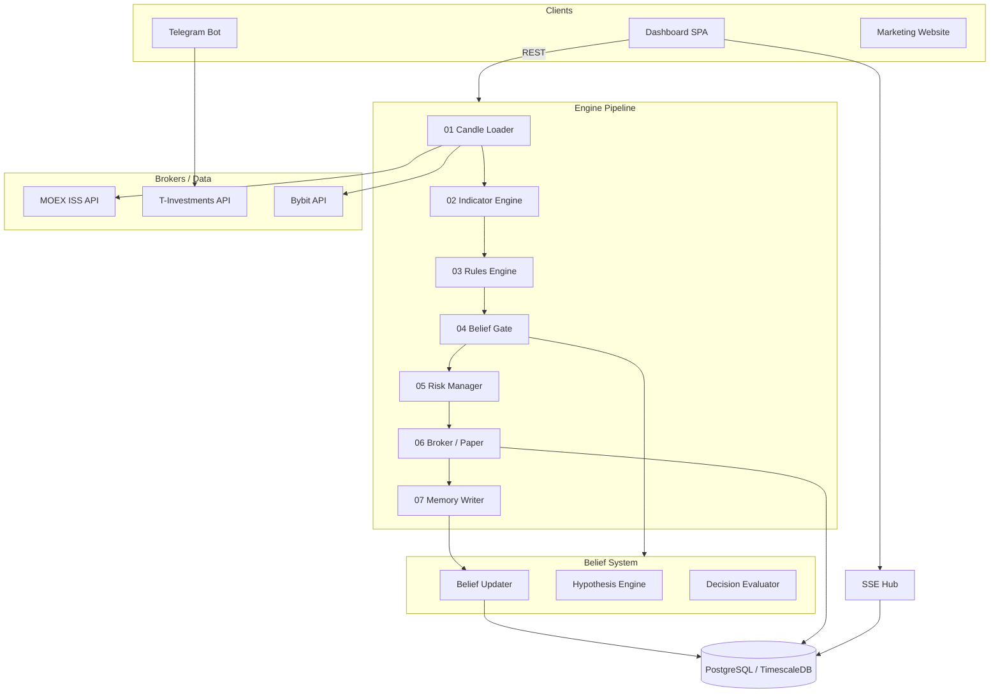

<div align="center">

# QuantFlow


**Институциональная платформа алгоритмической торговли с байесовской системой убеждений**

Belief Engine · Trading Dashboard · Telegram Bot · Signal Pipeline · Paper Sandbox · Marketing Website

[🇷🇺 Русская версия](#русская-версия) · [🇬🇧 English version](#english-version)

</div>

---

# Русская версия

## Содержание

- [О проекте](#о-проекте)
- [Система убеждений](#система-убеждений)
- [Конвейер движка](#конвейер-движка)
- [Возможности](#возможности)
- [Архитектура системы](#архитектура-системы)
- [Маркетинговый сайт](#маркетинговый-сайт)
- [Стек технологий](#стек-технологий)
- [Структура проекта](#структура-проекта)
- [Установка](#установка)
- [Конфигурация](#конфигурация)
- [API](#api)
- [Безопасность](#безопасность)
- [Roadmap](#roadmap)
- [Дисклеймер](#дисклеймер)

---

## О проекте

**QuantFlow** — алгоритмическая торговая платформа, построенная на принципе байесовского обновления убеждений. Система не предсказывает рынок и не использует ML/LLM для генерации сигналов. Вместо этого она измеряет, какие проверенные торговые правила работают прямо сейчас, и распределяет капитал строго по статистическому доверию.

**Ключевой принцип**: каждая стратегия получает численный уровень доверия (confidence), который обновляется после каждой сделки по закону Байеса. Размер позиции — прямая математическая функция этого доверия. Мнения не принимаются; принимаются только доказательства.

### Поддерживаемые рынки и брокеры

| Рынок | Брокер | Режим |
|-------|--------|-------|
| MOEX (акции, деривативы) | T-Инвестиции (Тинькофф) | Sandbox + Production |
| MOEX | Финам | В разработке |
| Крипто | Bybit | Spot + Derivatives |
| Все рынки | Paper Trading | Всегда доступен |

### Основные компоненты

| Компонент | Назначение |
|-----------|------------|
| **Belief Engine** | Байесовская система обновления доверия к стратегиям |
| **Engine Pipeline** | 7-этапный конвейер: данные → сигнал → исполнение → память |
| **Trading Dashboard** | Flask SPA-терминал: портфель, сигналы, бэктест, стратегии |
| **Telegram Bot** | Мобильное управление, уведомления, ручная торговля |
| **Paper Sandbox** | Виртуальный счёт — идентичный путь сигнала без риска |
| **Marketing Website** | Публичный Next.js-сайт (RU/EN), институциональный дизайн |

---

## Система убеждений

Это ядро проекта — то, что отличает QuantFlow от обычных торговых ботов.

### Принцип работы

```
Каждая стратегия имеет уровень доверия (confidence ∈ [0.05, 0.95]).

После каждой сделки:
  new_confidence = current + (target - current) × LEARNING_RATE

где target вычисляется из:
  - win_rate    (доля выигрышных сделок)
  - profit_factor (gross profit / gross loss)
  - sharpe_ratio  (скорректированная на риск доходность)
  - expectancy    (математическое ожидание на сделку)

До 20 подтверждённых сделок confidence = базовый уровень (без доверия).
```

### Ключевые константы

| Параметр | Значение | Смысл |
|----------|----------|-------|
| `MIN_TRADES_FOR_CONFIDENCE` | 20 | Минимум сделок для начала обучения |
| `CONFIDENCE_LEARNING_RATE` | 0.15 | Скорость адаптации (15% за сделку) |
| `MIN_CONFIDENCE` | 0.05 | Нижняя граница — никогда не нуль |
| `MAX_CONFIDENCE` | 0.95 | Верхняя граница — никогда не стопроцентная уверенность |

### Что делает система

- `belief_updater.py` — пересчитывает confidence после каждой сделки
- `decision_evaluator.py` — оценивает сигналы против текущего доверия
- `hypothesis_engine.py` — формирует и проверяет торговые гипотезы
- `memory_writer.py` — записывает историю обновлений в базу данных
- `feedback.py` — собирает результаты сделок для обучения
- `trading_orchestrator.py` — координирует весь цикл обучения

### Управление стратегиями

| Статус | Описание |
|--------|----------|
| `LIVE` | Стратегия торгует, confidence достаточна |
| `PAPER` | Торгует виртуально, накапливает историю |
| `FROZEN` | Confidence упала — капитал не распределяется, история сохраняется |
| `HYPOTHESIS` | Ожидает минимума сделок для первой оценки |

Замороженная стратегия **не удаляется**. Если рыночные условия вернутся, confidence восстановится через новые данные — постепенно, не с нуля.

---

## Конвейер движка

7-этапный детерминированный путь от данных до исполнения:

```
01 CANDLE LOADER     OHLCV-свечи из MOEX ISS / Bybit API
       ↓
02 INDICATOR ENGINE  RSI · ATR · EMA · MACD · BB · ADX · VWAP · Stochastic · CCI
       ↓
03 RULES ENGINE      12+ правил из knowledge/rules.yaml → SignalResult (BUY/SELL/HOLD + score)
       ↓
04 BELIEF GATE       Сверяет сигнал с текущим confidence стратегии
                     Слабое доверие → сигнал блокируется
       ↓
05 RISK MANAGER      ATR-стоп · размер позиции = f(confidence) · дневной лимит убытков
       ↓
06 BROKER / PAPER    TinkoffClient · BybitClient · PaperEngine
       ↓
07 MEMORY WRITER     Результат сделки → belief_updater → обновление confidence в БД
```

---

## Возможности

### Trading Dashboard

Профессиональный SPA-терминал на Flask + Vanilla JS.

**Разделы:**

| View | Клавиша | Описание |
|------|---------|----------|
| Dashboard | `1` | Баланс, PnL, equity curve, метрики, лог событий |
| Portfolio | `2` | Позиции, аллокация, котировки, Lightweight Charts |
| Signals | `3` | Live-сигналы, фильтры, генерация и исполнение |
| Backtest | `4` | Симуляции, equity/drawdown/heatmap, журнал сделок |
| Quant Hunter | `5` | Telegram Mini App встроен без iframe |
| Settings | — | Конфигурация, токены брокеров, Dashboard API Key |

**UI/UX:**
- CSS Grid layout с `SidebarProvider` (OPEN / COLLAPSED)
- Design System (`design-system.css`) — тёмная terminal-тема
- Графики: **Lightweight Charts** + **ECharts**
- Real-time через **SSE** (`/api/platform/stream`)
- Polling fallback каждые 12 сек (`QFSync`)
- Горячая клавиша `R` — принудительный refresh текущего view

---

### Telegram Bot

Полнофункциональный бот на `python-telegram-bot` ≥ 20 с inline-клавиатурами.

**Команды:**

```
/start  /dashboard  /portfolio  /positions  /orders
/balance  /statistics  /signal  /bot_status  /help
```

**Push-уведомления:** открытие/закрытие сделки, новый сигнал, исполнение ордера, ошибки брокера, срабатывание лимитов риска, изменение confidence стратегии.

**Безопасность:** whitelist по `TELEGRAM_CHAT_ID`, rate limiting, подтверждение критических операций.

---

### Paper Trading Sandbox

Виртуальный счёт с **идентичным путём сигнала** — тот же RulesEngine, тот же BeliefGate, тот же RiskManager. Отличается только финальное исполнение: вместо брокера — `PaperEngine`.

- Виртуальный баланс: **10 000 000 ₽** / **100 000 USDT** по умолчанию
- История paper-сделок формирует начальное доверие стратегии
- PnL рассчитывается по реальным рыночным ценам
- Агрегируется с брокерским портфелем в Platform Overview

**Таблицы БД:** `paper_accounts`, `paper_positions`, `paper_trades`, `equity_snapshots`

---

### Signal Engine

Правила-based движок — прозрачный, воспроизводимый, настраиваемый.

**Индикаторы** (библиотека `ta`):
RSI · MACD · EMA (fast/slow) · ATR · Bollinger Bands · ADX+DI · VWAP · Stochastic · CCI

**Правила** (`knowledge/rules.yaml`):
- 12+ правил BUY / SELL / HOLD с весовым скорингом
- Горячая перезагрузка без рестарта сервера
- Каждое правило — явные условия по индикаторам, без магии

**Пример правила:**

```yaml
- name: "RSI_Oversold_Bounce"
  description: "RSI выходит из зоны перепроданности"
  action: BUY
  weight: 1.0
  conditions:
    - indicator: rsi
      operator: "<"
      value: 35
    - indicator: macd_hist
      operator: ">"
      value: 0
```

---

### Backtest

| Движок | Файл | Запуск |
|--------|------|--------|
| Classic | `backtest/engine.py` | `python3 bot/main.py --backtest` |
| Advanced | `backtest/advanced_engine.py` | Platform API + Dashboard UI |

Параметры: комиссия 0.03%, slippage 0.01%, стартовый капитал 1 000 000 ₽.  
Результаты: equity curve · drawdown · heatmap · календарь доходности · журнал сделок.

---

## Архитектура системы


---

## Маркетинговый сайт

`website/` — публичный институциональный сайт на **Next.js 15** с TypeScript и Tailwind CSS v4.

### Технологии

| Категория | Стек |
|-----------|------|
| Framework | Next.js 15 (App Router, SSG) |
| Language | TypeScript 5 |
| Styles | Tailwind CSS v4 · CSS Design Tokens |
| i18n | next-intl (RU / EN) |
| Animation | GSAP 3 + ScrollTrigger · Motion (Framer) · Lenis smooth scroll |
| 3D | Three.js · React Three Fiber · Drei |
| Content | MDX (philosophy, engine pipeline, learning system) |
| Forms | react-hook-form · Zod |
| Analytics | PostHog · Vercel Analytics |
| Deployment | Vercel (SSG) |

### Разделы сайта

| Секция | Содержание |
|--------|------------|
| Hero | Signal Propagation визуализация, live-метрики стратегии |
| Philosophy | Три принципа: доказательства · ограниченное убеждение · адаптивность |
| Engine Pipeline | Интерактивный горизонтальный скроллер — 7 этапов конвейера |
| Learning System | Интерактивный confidence slider, trajectory chart |
| Dashboard Preview | Фотореалистичный мокап дашборда |
| Strategy Layer | Live-таблица стратегий (LIVE / PAPER / FROZEN) |
| Broker Integrations | T-Инвестиции · Bybit · Финам |
| Paper Sandbox | Объяснение paper trading без риска |
| Pricing | Тарифные планы (Research / Operator / Live) |
| FAQ | 5 частых вопросов |
| Telegram Bot | Описание интеграции |
| CTA | Форма запроса закрытого доступа |

### Запуск сайта

```bash
cd website
npm install
npm run dev      # localhost:3000
npm run build    # production build
```

---

## Стек технологий

### Торговая платформа (Python)

| Категория | Технология |
|-----------|------------|
| Runtime | Python 3.11+ |
| Web | Flask ≥ 3.1 |
| ORM | SQLAlchemy ≥ 2.0 |
| Database | PostgreSQL 15 + TimescaleDB |
| Telegram | python-telegram-bot ≥ 20 |
| Brokers | tinkoff-investments SDK · Bybit client |
| Analysis | pandas · ta · PyYAML |
| Security | cryptography · JWT · credential vault |
| Real-time | SSE (Server-Sent Events) |

### Dashboard Frontend (Vanilla JS)

| Категория | Технология |
|-----------|------------|
| UI | Vanilla JavaScript |
| Charts | Lightweight Charts 4.2 · ECharts 5.5 |
| State | `QFStore` → `QFRender` → views |
| Шрифты | Inter · JetBrains Mono |

### Маркетинговый сайт (Next.js)

| Категория | Технология |
|-----------|------------|
| Framework | Next.js 15 · React 19 |
| Styles | Tailwind CSS v4 · shadcn/ui |
| Animation | GSAP 3 · Motion · Lenis |
| 3D | Three.js · R3F |
| i18n | next-intl |

### Инфраструктура

| Категория | Технология |
|-----------|------------|
| Containers | Docker Compose |
| DB UI | Adminer (:8080) |
| Market Data | MOEX ISS REST API |
| Logging | Rotating file logs (10 MB × 5) |

---

## Структура проекта

```
Trading-Bot/
│
├── bot/                              # Торговая платформа (Python)
│   ├── main.py                       # Точка входа: торговый цикл + Telegram
│   ├── config.py                     # Конфигурация из .env
│   │
│   ├── learning/                     # Система убеждений (Belief Engine)
│   │   ├── belief_updater.py         # Байесовское обновление confidence
│   │   ├── decision_evaluator.py     # Оценка сигналов против confidence
│   │   ├── hypothesis_engine.py      # Формирование торговых гипотез
│   │   ├── memory_writer.py          # Запись результатов в БД
│   │   ├── feedback.py               # Сбор feedback после сделок
│   │   └── trading_orchestrator.py   # Координация всего цикла обучения
│   │
│   ├── signals/                      # Сигнальный движок
│   │   ├── indicators.py             # RSI, MACD, EMA, ATR, BB, ADX, VWAP, CCI
│   │   └── rules_engine.py           # YAML-правила → SignalResult
│   │
│   ├── risk/
│   │   ├── risk_manager.py           # ATR-стоп, лимиты, trailing stop
│   │   └── state_store.py            # Состояние риск-менеджера
│   │
│   ├── engine/
│   │   └── paper_engine.py           # Paper trading движок
│   │
│   ├── gateway/
│   │   └── trade_gateway.py          # Унифицированный шлюз к брокерам
│   │
│   ├── market/
│   │   └── data_hub.py               # Агрегатор рыночных данных
│   │
│   ├── broker/
│   │   ├── tinkoff_client.py         # T-Инвестиции API
│   │   ├── bybit_client.py           # Bybit API
│   │   └── registry.py               # Реестр брокеров
│   │
│   ├── backtest/
│   │   ├── engine.py                 # CLI-бэктестер
│   │   └── advanced_engine.py        # Platform backtest
│   │
│   ├── data/
│   │   └── loader.py                 # MOEX ISS → PostgreSQL candles
│   │
│   ├── qf_platform/                  # Platform layer
│   │   ├── schema.py                 # DDL: belief_system, paper, signals, backtest
│   │   ├── services/                 # portfolio, signals, paper, backtest, analytics
│   │   └── repositories/             # Data access objects
│   │
│   ├── realtime/
│   │   └── sse_hub.py                # SSE pub/sub
│   │
│   ├── auth/                         # Аутентификация
│   │   ├── jwt_service.py
│   │   ├── session_manager.py
│   │   ├── brute_force.py
│   │   └── user_repository.py
│   │
│   ├── security/
│   │   ├── credential_vault.py       # AES-шифрование токенов
│   │   ├── dashboard_auth.py         # Dashboard auth middleware
│   │   └── http_middleware.py        # HTTP security headers
│   │
│   ├── tg/                           # Telegram bot
│   │   ├── bot.py                    # Application factory
│   │   ├── handlers/                 # Handler modules
│   │   ├── menus/                    # Inline keyboards
│   │   ├── notifications/            # Push dispatcher
│   │   └── middlewares/              # Auth, rate limit, errors
│   │
│   └── ui/                           # Trading Dashboard
│       ├── dashboard.py              # Flask entry point (:5001)
│       ├── api/platform_routes.py    # /api/platform/*
│       ├── templates/dashboard.html  # SPA shell
│       └── static/
│           ├── core/                 # api, store, sync, layout, format
│           ├── views/render.js       # View renderers
│           ├── miniapp/              # CRYPTONITE Quant Hunter
│           ├── app.js, charts.js
│           └── design-system.css
│
├── website/                          # Маркетинговый сайт (Next.js 15)
│   ├── src/
│   │   ├── app/                      # App Router pages
│   │   ├── components/               # UI, sections, motion, scene
│   │   ├── content-layer/            # MDX content pipeline
│   │   ├── lib/                      # i18n, analytics, fonts, utils
│   │   └── styles/                   # Design tokens (color, typography, spacing)
│   ├── content/                      # MDX content (RU + EN)
│   │   ├── {locale}/philosophy/      # 3 philosophy cards
│   │   ├── {locale}/engine-pipeline/ # 7 pipeline stages
│   │   └── {locale}/learning-system/ # Learning system docs
│   └── messages/                     # i18n strings (ru.json, en.json)
│
├── knowledge/
│   └── rules.yaml                    # Торговые правила (12+, горячая перезагрузка)
│
├── tests/
│   └── platform_tests/               # Unit-тесты platform layer
│
├── docs/                             # Документация
├── infra/                            # logrotate и конфигурации
├── docker-compose.yml                # TimescaleDB (:5432) + Adminer (:8080)
├── requirements.txt
├── start.sh / start.ps1 / start.bat  # Скрипты запуска
└── .env.example
```

---

## Установка

### Требования

- **Python 3.11+**
- **Node.js 20+** (для маркетингового сайта)
- **Docker** и **Docker Compose**
- Токены: Tinkoff Invest API, Telegram Bot (опционально)

### Шаг 1 — Клонирование

```bash
git clone https://github.com/Pomiranov/Trading-Bot.git
cd Trading-Bot
git checkout merge-learning-nik
```

### Шаг 2 — Python-окружение

```bash
python3 -m venv .venv
source .venv/bin/activate        # Windows: .venv\Scripts\activate
pip install -r requirements.txt
```

### Шаг 3 — Конфигурация

```bash
cp .env.example .env
# Минимально: DB_PASSWORD
# Для торговли: TINKOFF_TOKEN, TELEGRAM_TOKEN
```

### Шаг 4 — База данных

```bash
docker compose up -d
# TimescaleDB → localhost:5432
# Adminer     → http://127.0.0.1:8080
```

Схема (`belief_system`, `paper_*`, `signals`, `backtest_*`) создаётся автоматически при первом старте Dashboard.

### Шаг 5 — Исторические данные (опционально)

```bash
python3 bot/data/loader.py SBER GAZP LKOH YNDX --interval 1d --days 365
```

### Шаг 6 — Запуск

```bash
# Всё сразу (macOS/Linux)
./start.sh

# Только Dashboard → http://127.0.0.1:5001
python3 bot/ui/dashboard.py

# Торговый цикл + Telegram
python3 bot/main.py

# Только Telegram-бот
python3 bot/main.py --bot-only

# CLI-бэктест
python3 bot/main.py --backtest

# Маркетинговый сайт → http://localhost:3000
cd website && npm install && npm run dev
```

> ⚠️ `TINKOFF_SANDBOX=true` по умолчанию. Не меняйте на `false` без полного понимания рисков.

---

## Конфигурация

Полный шаблон: [`.env.example`](.env.example)

### База данных

| Переменная | По умолчанию | Описание |
|------------|--------------|----------|
| `DB_HOST` | `localhost` | PostgreSQL host |
| `DB_PORT` | `5432` | Порт |
| `DB_NAME` | `trading_bot` | Имя БД |
| `DB_USER` | `trader` | Пользователь |
| `DB_PASSWORD` | — | **Обязательно** |

### Брокер Tinkoff

| Переменная | Описание |
|------------|----------|
| `TINKOFF_TOKEN` | API-токен |
| `TINKOFF_ACCOUNT_ID` | ID счёта |
| `TINKOFF_SANDBOX` | `true` = sandbox, `false` = live |

### Telegram

| Переменная | Описание |
|------------|----------|
| `TELEGRAM_TOKEN` | Токен от @BotFather |
| `TELEGRAM_CHAT_ID` | Основной chat ID |
| `TELEGRAM_ALLOWED_IDS` | Доп. разрешённые IDs |

### Dashboard

| Переменная | По умолчанию | Описание |
|------------|--------------|----------|
| `DASHBOARD_HOST` | `127.0.0.1` | Bind address |
| `DASHBOARD_PORT` | `5001` | Порт |
| `DASHBOARD_API_KEY` | — | API-ключ |
| `DASHBOARD_REQUIRE_API_KEY` | `false` | Требовать ключ |

### Торговля и риск

| Переменная | По умолчанию | Описание |
|------------|--------------|----------|
| `TICKERS` | `SBER,GAZP,…` | Отслеживаемые тикеры |
| `POLL_INTERVAL` | `60` | Интервал цикла (сек) |
| `RISK_MAX_POSITION_PCT` | `0.05` | Макс. % на позицию |
| `RISK_ATR_STOP_MULT` | `2.0` | Множитель ATR для стопа |
| `RISK_MAX_DAILY_LOSS_PCT` | `0.02` | Дневной лимит убытков |
| `RISK_MAX_OPEN_POSITIONS` | `5` | Макс. открытых позиций |

---

## API

### Platform API (`/api/platform/`)

| Метод | Endpoint | Описание |
|-------|----------|----------|
| GET | `/overview` | Сводка: баланс, PnL, брокеры, система |
| GET | `/portfolio` | Портфель (broker + paper) |
| GET | `/portfolio/positions` | Список позиций |
| GET | `/signals` | Сигналы с фильтрами |
| POST | `/signals/generate` | Генерация live-сигналов |
| POST | `/signals/{id}/execute` | Исполнение сигнала |
| GET | `/paper/account` | Paper-счёт и позиции |
| POST | `/paper/trade` | Открытие / закрытие paper-позиции |
| POST | `/backtest/run` | Запуск бэктеста |
| GET | `/backtest/runs` | История запусков |
| GET | `/backtest/runs/{id}/export` | Экспорт JSON |
| GET | `/health` | System health |
| GET | `/brokers` | Статус брокеров |
| GET | `/stream` | **SSE** real-time события |

---

## Безопасность

| Механизм | Реализация |
|----------|------------|
| Dashboard API Key | Заголовок `X-Dashboard-Api-Key` |
| Telegram Auth | Whitelist chat IDs + rate limiting |
| Credential Vault | AES-шифрование токенов на диске |
| JWT / Sessions | `auth/jwt_service.py`, `session_manager.py` |
| Brute Force | `auth/brute_force.py` |
| HTTP Headers | `X-Frame-Options`, `X-Content-Type-Options`, CSP |
| Audit Log | Security events в rotating-логах |
| Sandbox Mode | `TINKOFF_SANDBOX=true` по умолчанию |

---

## Roadmap

### ✅ Реализовано

- [x] Belief Engine — байесовское обновление confidence
- [x] 7-этапный Engine Pipeline с Memory Writer
- [x] Trading Dashboard (Flask SPA, CSS Grid, темная тема)
- [x] Platform layer (portfolio, signals, backtest, paper trading)
- [x] Paper Sandbox с идентичным путём сигнала
- [x] SSE real-time синхронизация
- [x] Telegram Bot (15+ handlers, push-уведомления)
- [x] Security hardening (vault, JWT, brute force, API key)
- [x] Marketing Website (Next.js 15, RU/EN, GSAP, Three.js)
- [x] Бэктест (Classic + Advanced с UI)
- [x] Bybit integration
- [x] CRYPTONITE Quant Hunter Mini App

### ⏳ Запланировано

- [ ] Finam broker integration
- [ ] WebSocket live quotes (сейчас SSE polling)
- [ ] Cloud save для прогресса Quant Hunter
- [ ] Расширенная аналитика портфеля
- [ ] CI/CD pipeline
- [ ] Публичная бета-версия

---

## Дисклеймер

QuantFlow предназначен для **образовательных и исследовательских** целей.  
Алгоритмическая торговля несёт реальные финансовые риски.  
Всегда тестируйте в sandbox-режиме. Авторы не несут ответственности за торговые убытки.

---
---
---

# English version

## Table of Contents

- [About](#about)
- [Belief System](#belief-system)
- [Engine Pipeline](#engine-pipeline)
- [Features](#features)
- [System Architecture](#system-architecture)
- [Marketing Website](#marketing-website)
- [Tech Stack](#tech-stack)
- [Project Structure](#project-structure)
- [Installation](#installation)
- [Configuration](#configuration)
- [API](#api-1)
- [Security](#security)
- [Roadmap](#roadmap-1)
- [Disclaimer](#disclaimer)

---

## About

**QuantFlow** is an algorithmic trading platform built on Bayesian belief updating. The system does not predict markets and does not use ML/LLM for signal generation. Instead it measures which verified trading rules are working right now and allocates capital strictly by statistical conviction.

**Core principle**: every strategy carries a numerical confidence score that updates after each trade via Bayes' law. Position size is a direct mathematical function of that confidence. Opinions are not accepted; only evidence is.

### Supported markets and brokers

| Market | Broker | Mode |
|--------|--------|------|
| MOEX (equities, derivatives) | T-Investments (Tinkoff) | Sandbox + Production |
| MOEX | Finam | In development |
| Crypto | Bybit | Spot + Derivatives |
| All markets | Paper Trading | Always available |

### Core components

| Component | Purpose |
|-----------|---------|
| **Belief Engine** | Bayesian confidence updater for trading strategies |
| **Engine Pipeline** | 7-stage pipeline: data → signal → execution → memory |
| **Trading Dashboard** | Flask SPA terminal: portfolio, signals, backtest, strategies |
| **Telegram Bot** | Mobile control, notifications, manual trading |
| **Paper Sandbox** | Virtual account — identical signal path, zero risk |
| **Marketing Website** | Public Next.js site (RU/EN), institutional design |

---

## Belief System

This is the core of the project — what distinguishes QuantFlow from ordinary trading bots.

### How it works

```
Each strategy holds a confidence score (confidence ∈ [0.05, 0.95]).

After each trade:
  new_confidence = current + (target - current) × LEARNING_RATE

where target is computed from:
  - win_rate       (fraction of winning trades)
  - profit_factor  (gross profit / gross loss)
  - sharpe_ratio   (risk-adjusted return)
  - expectancy     (expected value per trade)

Until 20 confirmed trades: confidence = base level (no trust granted).
```

### Key constants

| Parameter | Value | Meaning |
|-----------|-------|---------|
| `MIN_TRADES_FOR_CONFIDENCE` | 20 | Minimum trades before learning begins |
| `CONFIDENCE_LEARNING_RATE` | 0.15 | Adaptation speed (15% per trade) |
| `MIN_CONFIDENCE` | 0.05 | Floor — never zero |
| `MAX_CONFIDENCE` | 0.95 | Ceiling — never 100% certain |

### Strategy lifecycle

| Status | Description |
|--------|-------------|
| `LIVE` | Strategy is trading; confidence is sufficient |
| `PAPER` | Trading virtually, accumulating history |
| `FROZEN` | Confidence fell — capital removed, history preserved |
| `HYPOTHESIS` | Awaiting minimum trades for first evaluation |

A frozen strategy is **never deleted**. If market conditions that made it work return, confidence rebuilds through new evidence — gradually, not from scratch.

---

## Engine Pipeline

7-stage deterministic path from data to execution:

```
01 CANDLE LOADER     OHLCV candles from MOEX ISS / Bybit API
       ↓
02 INDICATOR ENGINE  RSI · ATR · EMA · MACD · BB · ADX · VWAP · Stochastic · CCI
       ↓
03 RULES ENGINE      12+ rules from knowledge/rules.yaml → SignalResult (BUY/SELL/HOLD + score)
       ↓
04 BELIEF GATE       Checks signal against current strategy confidence
                     Low conviction → signal is blocked
       ↓
05 RISK MANAGER      ATR stop · position size = f(confidence) · daily loss limit
       ↓
06 BROKER / PAPER    TinkoffClient · BybitClient · PaperEngine
       ↓
07 MEMORY WRITER     Trade result → belief_updater → confidence update in DB
```

---

## Features

### Trading Dashboard

Professional SPA terminal built with Flask + Vanilla JS.

**Views:**

| View | Key | Description |
|------|-----|-------------|
| Dashboard | `1` | Balance, PnL, equity curve, metrics, event log |
| Portfolio | `2` | Positions, allocation, tickers, Lightweight Charts |
| Signals | `3` | Live signals, filters, generate & execute |
| Backtest | `4` | Simulations, equity/drawdown/heatmap, trade journal |
| Quant Hunter | `5` | Telegram Mini App embedded without iframe |
| Settings | — | Config, broker tokens, Dashboard API Key |

---

### Telegram Bot

Full-featured bot on `python-telegram-bot` ≥ 20 with inline keyboards.

**Commands:**

```
/start  /dashboard  /portfolio  /positions  /orders
/balance  /statistics  /signal  /bot_status  /help
```

**Push notifications:** trade open/close, new signal, order fill, broker errors, risk limit triggers, strategy confidence changes.

**Security:** chat ID whitelist, rate limiting, confirmation for critical operations.

---

### Paper Trading Sandbox

Virtual account with an **identical signal path** — same RulesEngine, same BeliefGate, same RiskManager. Only the final execution differs: broker is replaced by `PaperEngine`.

- Default balance: **10,000,000 ₽** / **100,000 USDT**
- Paper trade history forms a strategy's initial confidence score
- PnL calculated from real market prices
- Aggregated with broker portfolio in Platform Overview

---

### Signal Engine

Rules-based engine — transparent, reproducible, configurable.

**Indicators** (`ta` library): RSI · MACD · EMA · ATR · Bollinger Bands · ADX+DI · VWAP · Stochastic · CCI

**Rules** (`knowledge/rules.yaml`): 12+ BUY/SELL/HOLD rules with weighted scoring. Hot-reload without restart.

**Example rule:**

```yaml
- name: "RSI_Oversold_Bounce"
  description: "RSI exiting oversold zone"
  action: BUY
  weight: 1.0
  conditions:
    - indicator: rsi
      operator: "<"
      value: 35
    - indicator: macd_hist
      operator: ">"
      value: 0
```

---

### Backtest

| Engine | File | Launch |
|--------|------|--------|
| Classic | `backtest/engine.py` | `python3 bot/main.py --backtest` |
| Advanced | `backtest/advanced_engine.py` | Platform API + Dashboard UI |

Parameters: commission 0.03%, slippage 0.01%, initial capital 1,000,000 ₽.  
Results: equity curve · drawdown · heatmap · return calendar · trade journal.

---

## System Architecture



---

## Marketing Website

`website/` — public institutional website built with **Next.js 15**, TypeScript, and Tailwind CSS v4.

### Tech

| Category | Stack |
|----------|-------|
| Framework | Next.js 15 (App Router, SSG) |
| Language | TypeScript 5 |
| Styles | Tailwind CSS v4 · CSS Design Tokens |
| i18n | next-intl (RU / EN) |
| Animation | GSAP 3 + ScrollTrigger · Motion · Lenis smooth scroll |
| 3D | Three.js · React Three Fiber · Drei |
| Content | MDX (philosophy, engine pipeline, learning system) |
| Forms | react-hook-form · Zod |
| Analytics | PostHog · Vercel Analytics |
| Deployment | Vercel (SSG) |

### Sections

| Section | Content |
|---------|---------|
| Hero | Signal propagation visualization, live strategy metrics |
| Philosophy | Three principles: evidence · bounded conviction · adaptivity |
| Engine Pipeline | Interactive horizontal scroller — 7 pipeline stages |
| Learning System | Interactive confidence slider, trajectory chart |
| Dashboard Preview | Photorealistic dashboard mockup |
| Strategy Layer | Live strategy table (LIVE / PAPER / FROZEN) |
| Broker Integrations | T-Investments · Bybit · Finam |
| Paper Sandbox | Paper trading explanation |
| Pricing | Tier plans (Research / Operator / Live) |
| FAQ | Frequently asked questions |
| Telegram Bot | Integration overview |
| CTA | Closed beta access request form |

### Run the website

```bash
cd website
npm install
npm run dev      # localhost:3000
npm run build    # production build
```

---

## Tech Stack

### Trading platform (Python)

| Category | Technology |
|----------|------------|
| Runtime | Python 3.11+ |
| Web | Flask ≥ 3.1 |
| ORM | SQLAlchemy ≥ 2.0 |
| Database | PostgreSQL 15 + TimescaleDB |
| Telegram | python-telegram-bot ≥ 20 |
| Brokers | tinkoff-investments SDK · Bybit client |
| Analysis | pandas · ta · PyYAML |
| Security | cryptography · JWT · credential vault |
| Real-time | SSE (Server-Sent Events) |

### Dashboard frontend (Vanilla JS)

| Category | Technology |
|----------|------------|
| UI | Vanilla JavaScript |
| Charts | Lightweight Charts 4.2 · ECharts 5.5 |
| State | `QFStore` → `QFRender` → views |

### Marketing website (Next.js)

| Category | Technology |
|----------|------------|
| Framework | Next.js 15 · React 19 |
| Styles | Tailwind CSS v4 · shadcn/ui |
| Animation | GSAP 3 · Motion · Lenis |
| 3D | Three.js · R3F |
| i18n | next-intl |

---

## Project Structure

```
Trading-Bot/
│
├── bot/                              # Trading platform (Python)
│   ├── main.py                       # Entry point: trading loop + Telegram
│   ├── config.py                     # .env configuration
│   │
│   ├── learning/                     # Belief Engine
│   │   ├── belief_updater.py         # Bayesian confidence update
│   │   ├── decision_evaluator.py     # Signal evaluation vs confidence
│   │   ├── hypothesis_engine.py      # Trading hypothesis formation
│   │   ├── memory_writer.py          # Write results to DB
│   │   ├── feedback.py               # Post-trade feedback collection
│   │   └── trading_orchestrator.py   # Learning cycle coordinator
│   │
│   ├── signals/                      # Signal engine
│   │   ├── indicators.py             # RSI, MACD, EMA, ATR, BB, ADX, VWAP, CCI
│   │   └── rules_engine.py           # YAML rules → SignalResult
│   │
│   ├── risk/
│   │   ├── risk_manager.py           # ATR stop, limits, trailing stop
│   │   └── state_store.py            # Risk state persistence
│   │
│   ├── engine/
│   │   └── paper_engine.py           # Paper trading engine
│   │
│   ├── gateway/
│   │   └── trade_gateway.py          # Unified broker gateway
│   │
│   ├── market/
│   │   └── data_hub.py               # Market data aggregator
│   │
│   ├── broker/
│   │   ├── tinkoff_client.py
│   │   ├── bybit_client.py
│   │   └── registry.py
│   │
│   ├── backtest/
│   │   ├── engine.py                 # CLI backtester
│   │   └── advanced_engine.py        # Platform backtest
│   │
│   ├── qf_platform/                  # Platform layer
│   │   ├── schema.py                 # DDL: belief_system, paper, signals
│   │   ├── services/                 # portfolio, signals, paper, backtest
│   │   └── repositories/             # Data access
│   │
│   ├── auth/                         # Authentication
│   │   ├── jwt_service.py
│   │   ├── session_manager.py
│   │   └── brute_force.py
│   │
│   ├── security/                     # Encryption, headers
│   ├── tg/                           # Telegram bot
│   ├── realtime/                     # SSE hub
│   └── ui/                           # Trading Dashboard (:5001)
│
├── website/                          # Marketing website (Next.js 15)
│   ├── src/
│   │   ├── app/
│   │   ├── components/
│   │   ├── content-layer/
│   │   ├── lib/
│   │   └── styles/
│   ├── content/                      # MDX content (RU + EN)
│   └── messages/                     # i18n strings
│
├── knowledge/
│   └── rules.yaml                    # Trading rules (12+, hot-reload)
│
├── tests/
├── docs/
├── docker-compose.yml                # TimescaleDB + Adminer
├── requirements.txt
├── start.sh / start.ps1 / start.bat
└── .env.example
```

---

## Installation

### Requirements

- **Python 3.11+**
- **Node.js 20+** (for marketing website)
- **Docker** and **Docker Compose**

### Step 1 — Clone

```bash
git clone https://github.com/Pomiranov/Trading-Bot.git
cd Trading-Bot
git checkout merge-learning-nik
```

### Step 2 — Python environment

```bash
python3 -m venv .venv
source .venv/bin/activate        # Windows: .venv\Scripts\activate
pip install -r requirements.txt
```

### Step 3 — Configuration

```bash
cp .env.example .env
# Minimum: DB_PASSWORD
# For trading: TINKOFF_TOKEN, TELEGRAM_TOKEN
```

### Step 4 — Database

```bash
docker compose up -d
# TimescaleDB → localhost:5432
# Adminer     → http://127.0.0.1:8080
```

Schema (`belief_system`, `paper_*`, `signals`, `backtest_*`) is created automatically on first Dashboard start.

### Step 5 — Historical data (optional)

```bash
python3 bot/data/loader.py SBER GAZP LKOH YNDX --interval 1d --days 365
```

### Step 6 — Run

```bash
# Everything at once (macOS/Linux)
./start.sh

# Dashboard only → http://127.0.0.1:5001
python3 bot/ui/dashboard.py

# Trading loop + Telegram
python3 bot/main.py

# Telegram bot only
python3 bot/main.py --bot-only

# CLI backtest
python3 bot/main.py --backtest

# Marketing website → http://localhost:3000
cd website && npm install && npm run dev
```

> ⚠️ `TINKOFF_SANDBOX=true` by default. Do not switch to `false` without fully understanding the risks.

---

## Configuration

Full template: [`.env.example`](.env.example)

### Database

| Variable | Default | Description |
|----------|---------|-------------|
| `DB_HOST` | `localhost` | PostgreSQL host |
| `DB_PORT` | `5432` | Port |
| `DB_NAME` | `trading_bot` | Database name |
| `DB_USER` | `trader` | Username |
| `DB_PASSWORD` | — | **Required** |

### Tinkoff broker

| Variable | Description |
|----------|-------------|
| `TINKOFF_TOKEN` | API token |
| `TINKOFF_ACCOUNT_ID` | Account ID |
| `TINKOFF_SANDBOX` | `true` = sandbox, `false` = live |

### Telegram

| Variable | Description |
|----------|-------------|
| `TELEGRAM_TOKEN` | Token from @BotFather |
| `TELEGRAM_CHAT_ID` | Primary chat ID |
| `TELEGRAM_ALLOWED_IDS` | Additional allowed IDs |

### Dashboard

| Variable | Default | Description |
|----------|---------|-------------|
| `DASHBOARD_HOST` | `127.0.0.1` | Bind address |
| `DASHBOARD_PORT` | `5001` | Port |
| `DASHBOARD_API_KEY` | — | API key header |
| `DASHBOARD_REQUIRE_API_KEY` | `false` | Require key for GET /api/* |

### Trading & risk

| Variable | Default | Description |
|----------|---------|-------------|
| `TICKERS` | `SBER,GAZP,…` | Watched tickers |
| `POLL_INTERVAL` | `60` | Loop interval (sec) |
| `RISK_MAX_POSITION_PCT` | `0.05` | Max % per position |
| `RISK_ATR_STOP_MULT` | `2.0` | ATR stop multiplier |
| `RISK_MAX_DAILY_LOSS_PCT` | `0.02` | Daily loss limit |
| `RISK_MAX_OPEN_POSITIONS` | `5` | Max open positions |

---

## API

### Platform API (`/api/platform/`)

| Method | Endpoint | Description |
|--------|----------|-------------|
| GET | `/overview` | Summary: balance, PnL, brokers, system |
| GET | `/portfolio` | Portfolio (broker + paper aggregation) |
| GET | `/portfolio/positions` | Position list |
| GET | `/signals` | Signals with filters |
| POST | `/signals/generate` | Generate live signals |
| POST | `/signals/{id}/execute` | Execute signal |
| GET | `/paper/account` | Paper account & positions |
| POST | `/paper/trade` | Open / close paper position |
| POST | `/backtest/run` | Run backtest |
| GET | `/backtest/runs` | Run history |
| GET | `/backtest/runs/{id}/export` | Export JSON |
| GET | `/health` | System health |
| GET | `/brokers` | Broker status |
| GET | `/stream` | **SSE** real-time events |

---

## Security

| Mechanism | Implementation |
|-----------|----------------|
| Dashboard API Key | `X-Dashboard-Api-Key` header |
| Telegram Auth | Whitelist chat IDs + rate limiting |
| Credential Vault | AES token encryption on disk |
| JWT / Sessions | `auth/jwt_service.py`, `session_manager.py` |
| Brute Force Protection | `auth/brute_force.py` |
| HTTP Headers | `X-Frame-Options`, `X-Content-Type-Options`, CSP |
| Audit Log | Security events in rotating logs |
| Sandbox Mode | `TINKOFF_SANDBOX=true` by default |

---

## Roadmap

### ✅ Completed

- [x] Belief Engine — Bayesian confidence updating
- [x] 7-stage Engine Pipeline with Memory Writer
- [x] Trading Dashboard (Flask SPA, dark terminal theme)
- [x] Platform layer (portfolio, signals, backtest, paper trading)
- [x] Paper Sandbox with identical signal path
- [x] SSE real-time synchronization
- [x] Telegram Bot (15+ handlers, push notifications)
- [x] Security hardening (vault, JWT, brute force, API key)
- [x] Marketing Website (Next.js 15, RU/EN, GSAP, Three.js)
- [x] Backtest engine (Classic + Advanced with UI)
- [x] Bybit integration
- [x] CRYPTONITE Quant Hunter Mini App

### ⏳ Planned

- [ ] Finam broker integration
- [ ] WebSocket live quotes (currently SSE polling)
- [ ] Cloud save for Quant Hunter progress
- [ ] Advanced portfolio analytics
- [ ] CI/CD pipeline
- [ ] Public beta release

---

## Disclaimer

QuantFlow is intended for **educational and research** purposes.  
Algorithmic trading carries real financial risk.  
Always test in sandbox mode. Authors are not liable for trading losses.
