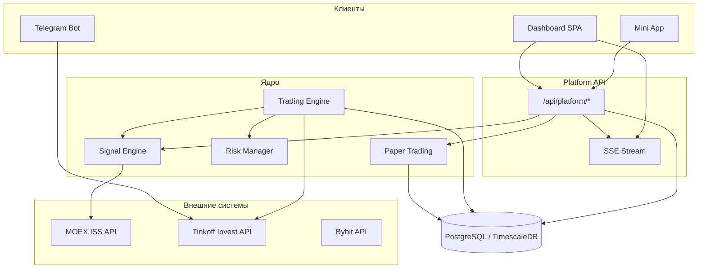
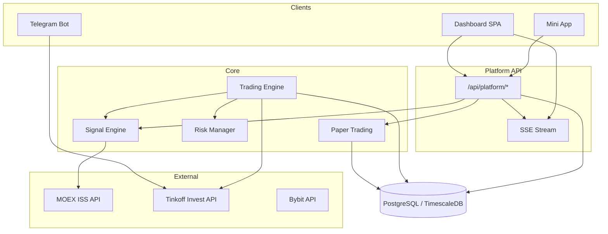

<div align="center">

# QuantFlow


**Профессиональная экосистема алгоритмической торговли**  
Trading Dashboard · Telegram Bot · Mini App · Signal Engine · Paper Sandbox · Gamification

[🇷🇺 Русская версия](#русская-версия) · [🇬🇧 English version](#english-version)

</div>

---

# Русская версия

## Содержание

- [О проекте](#о-проекте)
- [Возможности](#возможности)
- [Архитектура системы](#архитектура-системы)
- [Синхронизация](#синхронизация)
- [Стек технологий](#стек-технологий)
- [Структура проекта](#структура-проекта)
- [Установка](#установка)
- [Конфигурация](#конфигурация)
- [Использование](#использование)
- [API](#api)
- [Сигнальный движок](#сигнальный-движок)
- [CRYPTONITE Quant Hunter](#cryptonite-quant-hunter)
- [Безопасность](#безопасность)
- [Скриншоты](#скриншоты)
- [Roadmap](#roadmap)
- [Contributing](#contributing-1)
- [Лицензия](#лицензия)
- [Дисклеймер](#дисклеймер)

---

## О проекте

**QuantFlow** — это платформа алгоритмической торговли, объединяющая веб-терминал, Telegram-бота, Telegram Mini App и виртуальный торговый sandbox в единую экосистему.

Платформа ориентирована на:

- **MOEX** — загрузка свечей через MOEX ISS REST API
- **Tinkoff Invest API v2** — основной брокер (Sandbox / Production)
- **Bybit** — дополнительный брокерский клиент (опционально)
- **Paper Trading** — виртуальный портфель для тестирования без риска

QuantFlow **не использует ML/LLM** для генерации сигналов. Сигналы строятся на **технических индикаторах** и **YAML-правилах** с весовым скорингом — прозрачно, воспроизводимо и настраиваемо.

### Ключевые компоненты

| Компонент | Назначение |
|-----------|------------|
| **Trading Dashboard** | Веб-терминал: портфель, сигналы, бэктест, настройки, Mini App |
| **Telegram Bot** | Мобильное управление, уведомления, ручная торговля |
| **Telegram Mini App** | CRYPTONITE Quant Hunter — геймификация + Trade-вкладка |
| **Trading Engine** | Автоматический торговый цикл (`bot/main.py`) |
| **Platform Layer** | Единый API: портфель, сигналы, paper, бэктест, SSE |
| **Signal Engine** | Индикаторы + 12 правил из `knowledge/rules.yaml` |
| **Paper Sandbox** | Виртуальный счёт: 10M ₽ / 100K USDT по умолчанию |

---

## Возможности

### Trading Dashboard

Профессиональный SPA-терминал на Flask + Vanilla JS.

**Разделы (views):**

| View | Клавиша | Описание |
|------|---------|----------|
| Dashboard | `1` | Баланс, PnL, equity curve, метрики, лог событий |
| Portfolio | `2` | Позиции, аллокация, котировки, графики Lightweight Charts |
| Signals | `3` | Live-сигналы, фильтры, генерация и исполнение |
| Backtest | `4` | Запуск симуляций, equity/drawdown/heatmap, журнал сделок |
| Quant Hunter | `5` | Mini App встроен inline (без iframe) |
| Settings | — | Конфигурация, Tinkoff-токены, Dashboard API Key |

**UI/UX:**

- CSS Grid layout с `SidebarProvider` (OPEN / COLLAPSED)
- Отдельный fullscreen-layout для Mini App
- Design System (`design-system.css`) — тёмная terminal-тема
- Графики: **Lightweight Charts** + **ECharts**
- Real-time через **SSE** (`/api/platform/stream`)
- Polling fallback каждые 12 сек (`QFSync`)
- State: `QFStore` → `QFRender` → views

**Обновление:** `R` — принудительный refresh текущего view.

---

### Telegram Bot

Полнофункциональный бот на `python-telegram-bot` ≥ 20 с inline-клавиатурами.

**Главное меню:**

- 📊 Dashboard — обзор портфеля и статус бота
- 💼 Портфель · 📈 Позиции · 📑 Заявки · 📜 Операции
- 💰 Баланс · 📊 Аналитика · 📈 Статистика
- 🤖 Торговый бот — start / pause / resume / stop / status / logs
- 📡 Сигналы — просмотр и фильтрация
- 🔔 Уведомления — настройка push-типов
- ⚙ Настройки · 👤 Аккаунт · ❓ Помощь

**Команды:**

```
/start        /dashboard     /portfolio     /positions
/orders       /operations    /balance       /statistics
/signal       /bot_status    /help          /cancel
```

**Уведомления (push):**

- Открытие / закрытие сделки
- Новый сигнал
- Исполнение ордера
- Ошибки API брокера
- Срабатывание лимитов риска
- Старт / остановка бота

**Безопасность бота:**

- Авторизация по `TELEGRAM_CHAT_ID` + `TELEGRAM_ALLOWED_IDS`
- Rate limiting на действия
- Подтверждение критических торговых операций

**Поддерживаемые брокеры:**

- 🟢 **Tinkoff Invest** — полная интеграция
- 🟡 **Bybit** — клиент в кодовой базе
- ⚪ **Finam** — в разработке (UI-заглушка в настройках)

---

### Telegram Mini App — CRYPTONITE Quant Hunter

Web3-стиль геймификация в `bot/ui/static/miniapp/`.

**Два режима запуска:**

1. **Встроен в Dashboard** — view `Quant Hunter` (клавиша `5`)
2. **Standalone / Telegram** — `https://DOMAIN/static/miniapp/index.html`

> Для Telegram WebView нужен **HTTPS**. Инструкция: [`bot/ui/static/miniapp/BOTFATHER.md`](bot/ui/static/miniapp/BOTFATHER.md)

**Вкладки Mini App:**

| Вкладка | Содержание |
|---------|------------|
| **Trade** | Баланс, PnL, позиции, сигналы — данные из Platform API |
| **QUANT HUNTER** | Игровая механика |

**Игровые механики (реализовано):**

| Механика | Детали |
|----------|--------|
| **Типы Quant** | Common +1 · Rare +10 · Epic +100 · Legendary +1000 |
| **Energy** | 100/100, −1 за поимку, +10 каждые 10 мин |
| **Уровни** | Crypto Rookie → Market Hunter → Signal Seeker → Quant Master → Crypto Legend |
| **XP** | Прогрессия: `80 + level × 25` XP до следующего уровня |
| **Daily Missions** | Catch 50/200, Legendary hunt, 7-day login streak |
| **Achievements** | First Catch, 100 Quant, 7 Days, Level 10/50, Legendary Collector |
| **Leaderboard** | Rank · Username · Level · Points (localStorage) |
| **Combo** | Серия поимок подряд с визуальным feedback |
| **Визуал** | Cyberpunk UI, частицы, glow, holographic panels, canvas-фон |

Прогресс сохраняется в `localStorage` (`qf_quant_hunter_v2`).

---

### Trading Sandbox (Paper Trading)

Виртуальный портфель без реальных денег.

**Возможности:**

- Виртуальный баланс (по умолчанию **10 000 000 ₽** или **100 000 USDT**)
- Открытие / закрытие paper-позиций
- Расчёт unrealized PnL по реальным ценам из таблицы `candles`
- История сделок (`paper_trades`)
- Equity snapshots
- Исполнение сигналов в paper-режиме
- Агрегация с брокерским портфелем в Platform Overview

**Таблицы БД:** `paper_accounts`, `paper_positions`, `paper_trades`, `equity_snapshots`

---

### Signal Engine

Правила-based движок (не нейросеть).

**Индикаторы** (`signals/indicators.py`, библиотека `ta`):

- RSI · MACD · EMA (fast/slow) · ATR
- Bollinger Bands · ADX + DI · VWAP
- Stochastic · CCI

**Правила** (`knowledge/rules.yaml`):

- 12 правил BUY / SELL / HOLD
- Весовой скоринг (`weight`)
- Условия по индикаторам (`operator`, `value`)
- Горячая перезагрузка без рестарта

**Риск-менеджмент** (`risk/risk_manager.py`):

- ATR-стоп (`RISK_ATR_STOP_MULT`)
- Лимит размера позиции (`RISK_MAX_POSITION_PCT`)
- Макс. открытых позиций (`RISK_MAX_OPEN_POSITIONS`)
- Дневной лимит убытков (`RISK_MAX_DAILY_LOSS_PCT`)
- Trailing stop

---

### Backtest

Два движка:

| Движок | Файл | Назначение |
|--------|------|------------|
| Classic | `backtest/engine.py` | CLI: `python3 bot/main.py --backtest` |
| Advanced | `backtest/advanced_engine.py` | Platform API + Dashboard UI |

**Параметры бэктеста:**

- Strategy: `rules_engine`
- Commission: 0.03% (default)
- Slippage: 0.01%
- Initial capital: 1 000 000 ₽ (default)
- Результаты: equity curve, drawdown, heatmap, календарь доходности, журнал сделок
- Экспорт: `GET /api/platform/backtest/runs/{id}/export`

---

## Архитектура системы



**Поток данных:**

```
User
  ↓
Dashboard / Telegram Bot / Mini App
  ↓
Platform API + SSE Hub
  ↓
Trading Engine + Signal Engine + Risk Manager
  ↓
Broker Layer (Tinkoff · Bybit) + Paper Sandbox
  ↓
PostgreSQL / TimescaleDB
  ↓
Analytics (Backtest · Statistics · Dashboard Metrics)
```

---

## Синхронизация

**Dashboard ↔ Telegram Bot ↔ Trading Engine**

| Событие | SSE | REST API | Telegram |
|---------|-----|----------|----------|
| `signals_updated` | ✅ | `/api/platform/signals` | Push + меню Сигналы |
| `portfolio_updated` | ✅ | `/api/platform/portfolio` | Push + Портфель |
| `trade_executed` | ✅ | Paper / Broker | Push уведомление |
| `backtest_complete` | ✅ | `/api/platform/backtest/runs` | — |
| Balance updates | ✅ | `/api/platform/overview` | /balance |

**Frontend sync layer:**

```
MOEX/Broker → Platform Services → SSE Hub → QFSync → QFStore → QFRender → UI
                                      ↓
                              Mini App (Trade tab)
```

Polling fallback: 12 сек. Reconnect SSE: 5 сек.

---

## Стек технологий

### Frontend

| Категория | Технология |
|-----------|------------|
| UI | Vanilla JavaScript (без React/Vue) |
| Стили | Custom Design System CSS, CSS Grid, Flexbox |
| Layout | `SidebarProvider`, `AppLayout`, `MiniAppLayout` |
| Charts | Lightweight Charts 4.2 · ECharts 5.5 |
| State | `QFStore`, `QFSync`, `QFRender`, `QFApi` |
| Шрифты | Inter · JetBrains Mono · Orbitron |
| Template | Flask + Jinja2 |

### Backend

| Категория | Технология |
|-----------|------------|
| Runtime | Python 3.11+ |
| Web | Flask ≥ 3.1 |
| ORM | SQLAlchemy ≥ 2.0 |
| DB Driver | psycopg2-binary |
| Database | PostgreSQL 15 + TimescaleDB |
| Telegram | python-telegram-bot ≥ 20 |
| Brokers | tinkoff-investments SDK · Bybit client |
| Analysis | pandas · ta · PyYAML |
| HTTP | requests |
| Security | cryptography · credential vault · audit log |

### Infrastructure

| Категория | Технология |
|-----------|------------|
| Containers | Docker Compose |
| DB UI | Adminer (:8080) |
| Real-time | SSE (Server-Sent Events) |
| Market Data | MOEX ISS REST API |
| Logging | Rotating file logs (10 MB × 5) |
| Process Manager | `start.sh` |

---

## Структура проекта

```
Trading-Bot-main/
│
├── bot/                              # Исходный код приложения
│   ├── main.py                       # Торговый цикл + Telegram (thread)
│   ├── config.py                     # Конфигурация из .env
│   │
│   ├── signals/                      # Сигнальный движок
│   │   ├── indicators.py             # RSI, MACD, EMA, ATR, BB, ADX, VWAP
│   │   └── rules_engine.py           # YAML-правила → SignalResult
│   │
│   ├── risk/
│   │   └── risk_manager.py           # ATR-стоп, лимиты, trailing
│   │
│   ├── broker/
│   │   ├── tinkoff_client.py         # Tinkoff Invest API
│   │   ├── bybit_client.py           # Bybit API
│   │   └── registry.py               # Broker registry
│   │
│   ├── backtest/
│   │   ├── engine.py                 # CLI-бэктестер
│   │   └── advanced_engine.py        # Platform backtest
│   │
│   ├── data/
│   │   └── loader.py                 # MOEX ISS → PostgreSQL candles
│   │
│   ├── qf_platform/                  # Platform layer
│   │   ├── schema.py                 # DDL: paper, signals, backtest
│   │   ├── services/                 # portfolio, signals, paper, backtest
│   │   └── repositories/             # Data access
│   │
│   ├── realtime/
│   │   └── sse_hub.py                # SSE pub/sub
│   │
│   ├── tg/                           # Telegram bot
│   │   ├── bot.py                    # Application factory
│   │   ├── handlers/                 # 15+ handler modules
│   │   ├── menus/                    # Inline keyboards
│   │   ├── notifications/            # Push dispatcher
│   │   └── middlewares/              # Auth, rate limit, errors
│   │
│   ├── security/                     # Auth, encryption, middleware
│   │   ├── credential_vault.py
│   │   ├── dashboard_auth.py
│   │   └── http_middleware.py
│   │
│   ├── services/                     # Bot engine, statistics, broker service
│   │
│   └── ui/                           # Web Dashboard
│       ├── dashboard.py              # Flask entry point
│       ├── api/platform_routes.py    # /api/platform/*
│       ├── templates/dashboard.html  # SPA shell
│       └── static/
│           ├── core/                 # api, store, sync, layout, format
│           ├── views/render.js       # View renderers
│           ├── miniapp/              # Quant Hunter + Trade
│           │   ├── game.js
│           │   ├── miniapp.js
│           │   ├── miniapp.css
│           │   ├── index.html
│           │   └── BOTFATHER.md
│           ├── app.js, platform.js, charts.js
│           └── design-system.css, style.css
│
├── knowledge/
│   └── rules.yaml                    # 12 торговых правил
│
├── tests/
│   └── platform_tests/               # Unit-тесты platform layer
│
├── docs/                             # Расширенная документация
├── infra/                            # logrotate и др.
├── docker-compose.yml                # TimescaleDB + Adminer
├── requirements.txt
├── start.sh                          # Запуск всей системы
└── .env.example
```

---

## Установка

### Требования

- **Python 3.11+**
- **Docker** и **Docker Compose**
- **Git**
- (Опционально) Tinkoff Invest token, Telegram bot token

### Шаг 1 — Клонирование

```bash
git clone https://github.com/YOUR_ORG/Trading-Bot-main.git
cd Trading-Bot-main
```

### Шаг 2 — Окружение

```bash
python3 -m venv .venv
source .venv/bin/activate        # Windows: .venv\Scripts\activate
pip install -r requirements.txt
```

### Шаг 3 — Конфигурация

```bash
cp .env.example .env
# Отредактируйте .env — минимум DB_PASSWORD
```

### Шаг 4 — База данных

```bash
docker compose up -d
# TimescaleDB → localhost:5432
# Adminer     → http://127.0.0.1:8080
```

Схема platform-таблиц создаётся автоматически при старте Dashboard.

### Шаг 5 — Исторические данные (опционально)

```bash
python3 bot/data/loader.py SBER GAZP LKOH YNDX NVTK --interval 1d --days 365
```

### Шаг 6 — Запуск

**Вариант A — всё сразу:**

```bash
./start.sh
```

**Вариант B — по отдельности:**

```bash
# Dashboard → http://127.0.0.1:5001
python3 bot/ui/dashboard.py

# Торговый цикл + Telegram (в отдельном терминале)
python3 bot/main.py

# Только Telegram-бот
python3 bot/main.py --bot-only

# CLI-бэктест
python3 bot/main.py --backtest
```

> ⚠️ **Безопасность:** держите `TINKOFF_SANDBOX=true` до осознанного перехода на live-торговлю.

---

## Конфигурация

Полный шаблон: [`.env.example`](.env.example)

### База данных

| Переменная | По умолчанию | Описание |
|------------|--------------|----------|
| `DB_HOST` | `localhost` | PostgreSQL host |
| `DB_PORT` | `5432` | Порт |
| `DB_NAME` | `trading_bot` | Имя БД |
| `DB_USER` | `trader` | Пользователь |
| `DB_PASSWORD` | — | **Обязательно** |

### Брокер Tinkoff

| Переменная | Описание |
|------------|----------|
| `TINKOFF_TOKEN` | API-токен (t.xxx…) |
| `TINKOFF_ACCOUNT_ID` | ID счёта |
| `TINKOFF_SANDBOX` | `true` = песочница, `false` = боевой |

### Telegram

| Переменная | Описание |
|------------|----------|
| `TELEGRAM_TOKEN` | Токен от @BotFather |
| `TELEGRAM_CHAT_ID` | Основной chat ID |
| `TELEGRAM_ALLOWED_IDS` | Доп. ID через запятую |

### Dashboard

| Переменная | По умолчанию | Описание |
|------------|--------------|----------|
| `DASHBOARD_HOST` | `127.0.0.1` | Bind address |
| `DASHBOARD_PORT` | `5001` | Порт |
| `DASHBOARD_API_KEY` | — | API-ключ (заголовок `X-Dashboard-Api-Key`) |
| `DASHBOARD_REQUIRE_API_KEY` | `false` | Требовать ключ для GET /api/* |

### Торговля и риск

| Переменная | По умолчанию | Описание |
|------------|--------------|----------|
| `TICKERS` | `SBER,GAZP,…` | Отслеживаемые тикеры |
| `POLL_INTERVAL` | `60` | Интервал цикла (сек) |
| `RISK_MAX_POSITION_PCT` | `0.05` | Макс. % на позицию |
| `RISK_ATR_STOP_MULT` | `2.0` | Множитель ATR для стопа |
| `RISK_MAX_DAILY_LOSS_PCT` | `0.02` | Дневной лимит убытков |
| `RISK_MAX_OPEN_POSITIONS` | `5` | Макс. открытых позиций |

### Безопасность

| Переменная | Описание |
|------------|----------|
| `SECRETS_MASTER_KEY` | 64-char hex — шифрование токенов на диске |
| `VAULT_ADDR` / `VAULT_TOKEN` | HashiCorp Vault (опционально) |

---

## Использование

### Dashboard

1. Откройте `http://127.0.0.1:5001`
2. Навигация: sidebar или клавиши `1`–`5`
3. Сворачивание sidebar — кнопка «Свернуть» (состояние в `localStorage`)
4. Quant Hunter — встроен в Dashboard, вкладка QUANT HUNTER открывается по умолчанию

### Telegram Bot

1. Создайте бота через @BotFather
2. Укажите `TELEGRAM_TOKEN` и `TELEGRAM_CHAT_ID` в `.env`
3. Запустите `python3 bot/main.py --bot-only` или полный `main.py`
4. Отправьте `/start` боту

### Mini App в Telegram

1. Опубликуйте Dashboard на HTTPS
2. Следуйте [`BOTFATHER.md`](bot/ui/static/miniapp/BOTFATHER.md)
3. Web App URL: `https://YOUR-DOMAIN/static/miniapp/index.html`

---

## API

### Platform API (`/api/platform/`)

| Метод | Endpoint | Описание |
|-------|----------|----------|
| GET | `/overview` | Сводка: баланс, PnL, брокеры, система |
| GET | `/portfolio` | Портфель (агрегация broker + paper) |
| GET | `/portfolio/positions` | Список позиций |
| GET | `/signals` | Сигналы (фильтры: exchange, status, limit) |
| POST | `/signals/generate` | Генерация live-сигналов |
| POST | `/signals/{id}/execute` | Исполнение сигнала |
| GET | `/paper/account` | Paper-счёт и позиции |
| POST | `/paper/trade` | Открытие / закрытие paper-позиции |
| POST | `/backtest/run` | Запуск бэктеста |
| GET | `/backtest/runs` | История запусков |
| GET | `/backtest/runs/{id}/export` | Экспорт JSON |
| GET | `/health` | System health |
| GET | `/brokers` | Статус брокеров |
| GET | `/stream` | **SSE** — real-time события |

### Legacy Dashboard API (`/api/`)

| Endpoint | Описание |
|----------|----------|
| `/api/stats` | Win rate, Sharpe, drawdown |
| `/api/equity` | Equity curve |
| `/api/candles` | OHLCV свечи |
| `/api/signals/live` | Live-индикаторы по тикеру |
| `/api/settings` | Конфигурация приложения |
| `/api/tinkoff/*` | Прямой доступ к Tinkoff portfolio |

---

## Сигнальный движок

### Как работает

1. `MoexLoader` загружает OHLCV свечи (MOEX ISS)
2. `IndicatorEngine` рассчитывает индикаторы на pandas DataFrame
3. `RulesEngine` проверяет 12 правил из YAML
4. Результат: `BUY` / `SELL` / `HOLD` + score + metadata
5. `RiskManager` проверяет допустимость сделки
6. `TinkoffClient` исполняет ордер (или Paper Trading для sandbox)

### Пример правила (YAML)

```yaml
- name: "RSI_Oversold_Bounce"
  description: "RSI выходит из перепроданности"
  action: BUY
  weight: 1.0
  conditions:
    - indicator: rsi
      operator: "<"
      value: 35
    - indicator: macd_hist
      operator: ">"
      value: 0
```

---

## CRYPTONITE Quant Hunter

### Игровой цикл

```
User Action (catch Quant)
    ↓
Reward (points + XP)
    ↓
Progression (level up)
    ↓
Upgrade (titles, skins)
    ↓
New Challenge (missions, achievements)
```

### Типы Quant

| Тип | Очки | Spawn rate | Lifetime |
|-----|------|------------|----------|
| Common ◇ | +1 | 55% | 4000 ms |
| Rare ◆ | +10 | 28% | 2800 ms |
| Epic ✦ | +100 | 14% | 2000 ms |
| Legendary ★ | +1000 | 3% | 1500 ms |

### Retention-механики

- **Energy cap** — возврат через 10–100 мин
- **Daily missions** — ежедневные цели
- **7-day streak** — редкий скин `holo-rare`
- **Leaderboard** — соревновательный элемент

---

## Безопасность

| Механизм | Реализация |
|----------|------------|
| Dashboard API Key | Заголовок `X-Dashboard-Api-Key` |
| Telegram Auth | Whitelist chat IDs |
| Credential Vault | AES-шифрование токенов (`SECRETS_MASTER_KEY`) |
| HTTP Headers | `X-Frame-Options`, `X-Content-Type-Options`, `Referrer-Policy` |
| Audit Log | Security events в логах |
| Redaction | Маскирование секретов в логах |
| Rate Limiting | Telegram middleware |
| Sandbox Mode | `TINKOFF_SANDBOX=true` по умолчанию |

---

## Скриншоты

> Добавьте изображения в `docs/screenshots/` и раскомментируйте.

| Dashboard | Portfolio |
|:---:|:---:|
| _placeholder_ | _placeholder_ |

| Signals | Backtest |
|:---:|:---:|
| _placeholder_ | _placeholder_ |

| Quant Hunter Mini App |
|:---:|
| _placeholder_ |

---

## Roadmap

### ✅ Completed

- Dashboard redesign (terminal UI, CSS Grid, SidebarProvider)
- Platform layer (portfolio, signals, backtest, paper trading)
- SSE-синхронизация Dashboard ↔ Mini App
- Paper Trading Sandbox (10M ₽ / 100K USDT)
- CRYPTONITE Quant Hunter (energy, levels, missions, leaderboard)
- Telegram bot с 15+ handlers и push-уведомлениями
- Security hardening (vault, API key, audit)
- Inline Mini App embed (без iframe)

### ⏳ Upcoming

- Улучшение scoring-модели сигналов
- Finam broker integration
- Расширение Bybit-функционала
- Advanced portfolio analytics
- Cloud save для игрового прогресса
- WebSocket live quotes (сейчас SSE)
- Скриншоты и CI/CD pipeline

---

## Contributing

1. **Fork** репозитория
2. Создайте ветку: `git checkout -b feature/описание`
3. Внесите изменения
4. Запустите тесты:

```bash
python3 -m pytest tests/
```

5. Откройте **Pull Request** с описанием изменений

Для багов — GitHub Issues. Для security-уязвимостей — не создавайте публичные issues.

---

## Лицензия

Файл `LICENSE` в репозитории **отсутствует**.  
В предыдущих версиях документации упоминалась лицензия **MIT** — рекомендуется добавить `LICENSE` файл.

---

## Дисклеймер

QuantFlow предназначен для **образовательных и исследовательских** целей.  
Алгоритмическая торговля связана с финансовыми рисками.  
Всегда тестируйте в sandbox-режиме. Авторы не несут ответственности за торговые убытки.

---
---
---

# English version

## Table of Contents

- [About](#about)
- [Features](#features-1)
- [System Architecture](#system-architecture)
- [Synchronization](#synchronization)
- [Tech Stack](#tech-stack)
- [Project Structure](#project-structure)
- [Installation](#installation)
- [Configuration](#configuration)
- [Usage](#usage)
- [API](#api-1)
- [Signal Engine](#signal-engine)
- [CRYPTONITE Quant Hunter](#cryptonite-quant-hunter-1)
- [Security](#security)
- [Screenshots](#screenshots-1)
- [Roadmap](#roadmap-1)
- [Contributing](#contributing)
- [License](#license)
- [Disclaimer](#disclaimer)

---

## About

**QuantFlow** is an algorithmic trading platform that unifies a web terminal, Telegram bot, Telegram Mini App, and virtual paper-trading sandbox into a single ecosystem.

The platform focuses on:

- **MOEX** — candle data via MOEX ISS REST API
- **Tinkoff Invest API v2** — primary broker (Sandbox / Production)
- **Bybit** — optional broker client
- **Paper Trading** — risk-free virtual portfolio

QuantFlow does **not** use ML/LLM for signal generation. Signals are built from **technical indicators** and **YAML rules** with weighted scoring — transparent, reproducible, and configurable.

### Core Components

| Component | Purpose |
|-----------|---------|
| **Trading Dashboard** | Web terminal: portfolio, signals, backtest, settings, Mini App |
| **Telegram Bot** | Mobile control, notifications, manual trading |
| **Telegram Mini App** | CRYPTONITE Quant Hunter — gamification + Trade tab |
| **Trading Engine** | Automated trading loop (`bot/main.py`) |
| **Platform Layer** | Unified API: portfolio, signals, paper, backtest, SSE |
| **Signal Engine** | Indicators + 12 rules from `knowledge/rules.yaml` |
| **Paper Sandbox** | Virtual account: 10M ₽ / 100K USDT by default |

---

## Features

### Trading Dashboard

Professional SPA terminal built with Flask + Vanilla JS.

**Views:**

| View | Hotkey | Description |
|------|--------|-------------|
| Dashboard | `1` | Balance, PnL, equity curve, metrics, event log |
| Portfolio | `2` | Positions, allocation, tickers, Lightweight Charts |
| Signals | `3` | Live signals, filters, generate & execute |
| Backtest | `4` | Simulations, equity/drawdown/heatmap, trade journal |
| Quant Hunter | `5` | Mini App embedded inline (no iframe) |
| Settings | — | Config, Tinkoff tokens, Dashboard API Key |

**UI/UX:**

- CSS Grid layout with `SidebarProvider` (OPEN / COLLAPSED)
- Dedicated fullscreen layout for Mini App
- Design System (`design-system.css`) — dark terminal theme
- Charts: **Lightweight Charts** + **ECharts**
- Real-time via **SSE** (`/api/platform/stream`)
- Polling fallback every 12s (`QFSync`)
- State: `QFStore` → `QFRender` → views

**Refresh:** press `R` to reload the current view.

---

### Telegram Bot

Full-featured bot on `python-telegram-bot` ≥ 20 with inline keyboards.

**Main menu:**

- 📊 Dashboard — portfolio overview & bot status
- 💼 Portfolio · 📈 Positions · 📑 Orders · 📜 Operations
- 💰 Balance · 📊 Analytics · 📈 Statistics
- 🤖 Trading Bot — start / pause / resume / stop / status / logs
- 📡 Signals — browse & filter
- 🔔 Notifications — push type settings
- ⚙ Settings · 👤 Account · ❓ Help

**Commands:**

```
/start        /dashboard     /portfolio     /positions
/orders       /operations    /balance       /statistics
/signal       /bot_status    /help          /cancel
```

**Push notifications:**

- Trade open / close
- New signal
- Order fill
- Broker API errors
- Risk limit triggers
- Bot start / stop

**Bot security:**

- Authorization via `TELEGRAM_CHAT_ID` + `TELEGRAM_ALLOWED_IDS`
- Rate limiting on actions
- Confirmation for critical trade operations

**Supported brokers:**

- 🟢 **Tinkoff Invest** — full integration
- 🟡 **Bybit** — client in codebase
- ⚪ **Finam** — in development (settings UI stub)

---

### Telegram Mini App — CRYPTONITE Quant Hunter

Web3-style gamification in `bot/ui/static/miniapp/`.

**Launch modes:**

1. **Embedded in Dashboard** — `Quant Hunter` view (key `5`)
2. **Standalone / Telegram** — `https://DOMAIN/static/miniapp/index.html`

> Telegram WebView requires **HTTPS**. Setup guide: [`bot/ui/static/miniapp/BOTFATHER.md`](bot/ui/static/miniapp/BOTFATHER.md)

**Mini App tabs:**

| Tab | Content |
|-----|---------|
| **Trade** | Balance, PnL, positions, signals — from Platform API |
| **QUANT HUNTER** | Game mechanics |

**Game mechanics (implemented):**

| Mechanic | Details |
|----------|---------|
| **Quant types** | Common +1 · Rare +10 · Epic +100 · Legendary +1000 |
| **Energy** | 100/100, −1 per catch, +10 every 10 min |
| **Levels** | Crypto Rookie → Market Hunter → Signal Seeker → Quant Master → Crypto Legend |
| **XP** | Progression: `80 + level × 25` XP to next level |
| **Daily Missions** | Catch 50/200, Legendary hunt, 7-day login streak |
| **Achievements** | First Catch, 100 Quant, 7 Days, Level 10/50, Legendary Collector |
| **Leaderboard** | Rank · Username · Level · Points (localStorage) |
| **Combo** | Consecutive catches with visual feedback |
| **Visuals** | Cyberpunk UI, particles, glow, holographic panels, canvas background |

Progress is stored in `localStorage` (`qf_quant_hunter_v2`).

---

### Trading Sandbox (Paper Trading)

Virtual portfolio without real money.

**Capabilities:**

- Virtual balance (default **10,000,000 ₽** or **100,000 USDT**)
- Open / close paper positions
- Unrealized PnL calculated from real `candles` prices
- Trade history (`paper_trades`)
- Equity snapshots
- Signal execution in paper mode
- Aggregation with broker portfolio in Platform Overview

**DB tables:** `paper_accounts`, `paper_positions`, `paper_trades`, `equity_snapshots`

---

### Signal Engine

Rules-based engine (not a neural network).

**Indicators** (`signals/indicators.py`, `ta` library):

- RSI · MACD · EMA (fast/slow) · ATR
- Bollinger Bands · ADX + DI · VWAP
- Stochastic · CCI

**Rules** (`knowledge/rules.yaml`):

- 12 BUY / SELL / HOLD rules
- Weighted scoring (`weight`)
- Indicator conditions (`operator`, `value`)
- Hot-reload without restart

**Risk management** (`risk/risk_manager.py`):

- ATR stop (`RISK_ATR_STOP_MULT`)
- Position size limit (`RISK_MAX_POSITION_PCT`)
- Max open positions (`RISK_MAX_OPEN_POSITIONS`)
- Daily loss limit (`RISK_MAX_DAILY_LOSS_PCT`)
- Trailing stop

---

### Backtest

Two engines:

| Engine | File | Purpose |
|--------|------|---------|
| Classic | `backtest/engine.py` | CLI: `python3 bot/main.py --backtest` |
| Advanced | `backtest/advanced_engine.py` | Platform API + Dashboard UI |

**Backtest parameters:**

- Strategy: `rules_engine`
- Commission: 0.03% (default)
- Slippage: 0.01%
- Initial capital: 1,000,000 ₽ (default)
- Results: equity curve, drawdown, heatmap, return calendar, trade journal
- Export: `GET /api/platform/backtest/runs/{id}/export`

---

## System Architecture



**Data flow:**

```
User
  ↓
Dashboard / Telegram Bot / Mini App
  ↓
Platform API + SSE Hub
  ↓
Trading Engine + Signal Engine + Risk Manager
  ↓
Broker Layer (Tinkoff · Bybit) + Paper Sandbox
  ↓
PostgreSQL / TimescaleDB
  ↓
Analytics (Backtest · Statistics · Dashboard Metrics)
```

---

## Synchronization

**Dashboard ↔ Telegram Bot ↔ Trading Engine**

| Event | SSE | REST API | Telegram |
|-------|-----|----------|----------|
| `signals_updated` | ✅ | `/api/platform/signals` | Push + Signals menu |
| `portfolio_updated` | ✅ | `/api/platform/portfolio` | Push + Portfolio |
| `trade_executed` | ✅ | Paper / Broker | Push notification |
| `backtest_complete` | ✅ | `/api/platform/backtest/runs` | — |
| Balance updates | ✅ | `/api/platform/overview` | /balance |

**Frontend sync layer:**

```
MOEX/Broker → Platform Services → SSE Hub → QFSync → QFStore → QFRender → UI
                                      ↓
                              Mini App (Trade tab)
```

Polling fallback: 12s. SSE reconnect: 5s.

---

## Tech Stack

### Frontend

| Category | Technology |
|----------|------------|
| UI | Vanilla JavaScript (no React/Vue) |
| Styles | Custom Design System CSS, CSS Grid, Flexbox |
| Layout | `SidebarProvider`, `AppLayout`, `MiniAppLayout` |
| Charts | Lightweight Charts 4.2 · ECharts 5.5 |
| State | `QFStore`, `QFSync`, `QFRender`, `QFApi` |
| Fonts | Inter · JetBrains Mono · Orbitron |
| Template | Flask + Jinja2 |

### Backend

| Category | Technology |
|----------|------------|
| Runtime | Python 3.11+ |
| Web | Flask ≥ 3.1 |
| ORM | SQLAlchemy ≥ 2.0 |
| DB Driver | psycopg2-binary |
| Database | PostgreSQL 15 + TimescaleDB |
| Telegram | python-telegram-bot ≥ 20 |
| Brokers | tinkoff-investments SDK · Bybit client |
| Analysis | pandas · ta · PyYAML |
| HTTP | requests |
| Security | cryptography · credential vault · audit log |

### Infrastructure

| Category | Technology |
|----------|------------|
| Containers | Docker Compose |
| DB UI | Adminer (:8080) |
| Real-time | SSE (Server-Sent Events) |
| Market Data | MOEX ISS REST API |
| Logging | Rotating file logs (10 MB × 5) |
| Process Manager | `start.sh` |

---

## Project Structure

```
Trading-Bot-main/
│
├── bot/                              # Application source
│   ├── main.py                       # Trading loop + Telegram (thread)
│   ├── config.py                     # .env configuration
│   │
│   ├── signals/                      # Signal engine
│   │   ├── indicators.py             # RSI, MACD, EMA, ATR, BB, ADX, VWAP
│   │   └── rules_engine.py           # YAML rules → SignalResult
│   │
│   ├── risk/
│   │   └── risk_manager.py           # ATR stop, limits, trailing
│   │
│   ├── broker/
│   │   ├── tinkoff_client.py         # Tinkoff Invest API
│   │   ├── bybit_client.py           # Bybit API
│   │   └── registry.py               # Broker registry
│   │
│   ├── backtest/
│   │   ├── engine.py                 # CLI backtester
│   │   └── advanced_engine.py        # Platform backtest
│   │
│   ├── data/
│   │   └── loader.py                 # MOEX ISS → PostgreSQL candles
│   │
│   ├── qf_platform/                  # Platform layer
│   │   ├── schema.py                 # DDL: paper, signals, backtest
│   │   ├── services/                 # portfolio, signals, paper, backtest
│   │   └── repositories/             # Data access
│   │
│   ├── realtime/
│   │   └── sse_hub.py                # SSE pub/sub
│   │
│   ├── tg/                           # Telegram bot
│   │   ├── bot.py                    # Application factory
│   │   ├── handlers/                 # 15+ handler modules
│   │   ├── menus/                    # Inline keyboards
│   │   ├── notifications/            # Push dispatcher
│   │   └── middlewares/              # Auth, rate limit, errors
│   │
│   ├── security/                     # Auth, encryption, middleware
│   │
│   ├── services/                     # Bot engine, statistics
│   │
│   └── ui/                           # Web Dashboard
│       ├── dashboard.py              # Flask entry point
│       ├── api/platform_routes.py    # /api/platform/*
│       ├── templates/dashboard.html  # SPA shell
│       └── static/
│           ├── core/                 # api, store, sync, layout
│           ├── views/render.js
│           └── miniapp/              # Quant Hunter + Trade
│
├── knowledge/
│   └── rules.yaml                    # 12 trading rules
│
├── tests/
│   └── platform_tests/
│
├── docs/
├── docker-compose.yml
├── requirements.txt
├── start.sh
└── .env.example
```

---

## Installation

### Requirements

- **Python 3.11+**
- **Docker** & **Docker Compose**
- **Git**
- (Optional) Tinkoff Invest token, Telegram bot token

### Step 1 — Clone

```bash
git clone https://github.com/YOUR_ORG/Trading-Bot-main.git
cd Trading-Bot-main
```

### Step 2 — Environment

```bash
python3 -m venv .venv
source .venv/bin/activate        # Windows: .venv\Scripts\activate
pip install -r requirements.txt
```

### Step 3 — Configuration

```bash
cp .env.example .env
# Edit .env — at minimum set DB_PASSWORD
```

### Step 4 — Database

```bash
docker compose up -d
# TimescaleDB → localhost:5432
# Adminer     → http://127.0.0.1:8080
```

Platform schema is created automatically on Dashboard startup.

### Step 5 — Historical data (optional)

```bash
python3 bot/data/loader.py SBER GAZP LKOH YNDX NVTK --interval 1d --days 365
```

### Step 6 — Run

**Option A — all at once:**

```bash
./start.sh
```

**Option B — separately:**

```bash
# Dashboard → http://127.0.0.1:5001
python3 bot/ui/dashboard.py

# Trading loop + Telegram (separate terminal)
python3 bot/main.py

# Telegram bot only
python3 bot/main.py --bot-only

# CLI backtest
python3 bot/main.py --backtest
```

> ⚠️ **Safety:** keep `TINKOFF_SANDBOX=true` until you intentionally switch to live trading.

---

## Configuration

Full template: [`.env.example`](.env.example)

### Database

| Variable | Default | Description |
|----------|---------|-------------|
| `DB_HOST` | `localhost` | PostgreSQL host |
| `DB_PORT` | `5432` | Port |
| `DB_NAME` | `trading_bot` | Database name |
| `DB_USER` | `trader` | Username |
| `DB_PASSWORD` | — | **Required** |

### Tinkoff Broker

| Variable | Description |
|----------|-------------|
| `TINKOFF_TOKEN` | API token (t.xxx…) |
| `TINKOFF_ACCOUNT_ID` | Account ID |
| `TINKOFF_SANDBOX` | `true` = sandbox, `false` = live |

### Telegram

| Variable | Description |
|----------|-------------|
| `TELEGRAM_TOKEN` | Token from @BotFather |
| `TELEGRAM_CHAT_ID` | Primary chat ID |
| `TELEGRAM_ALLOWED_IDS` | Additional IDs, comma-separated |

### Dashboard

| Variable | Default | Description |
|----------|---------|-------------|
| `DASHBOARD_HOST` | `127.0.0.1` | Bind address |
| `DASHBOARD_PORT` | `5001` | Port |
| `DASHBOARD_API_KEY` | — | API key (`X-Dashboard-Api-Key` header) |
| `DASHBOARD_REQUIRE_API_KEY` | `false` | Require key for GET /api/* |

### Trading & Risk

| Variable | Default | Description |
|----------|---------|-------------|
| `TICKERS` | `SBER,GAZP,…` | Watched tickers |
| `POLL_INTERVAL` | `60` | Loop interval (sec) |
| `RISK_MAX_POSITION_PCT` | `0.05` | Max % per position |
| `RISK_ATR_STOP_MULT` | `2.0` | ATR stop multiplier |
| `RISK_MAX_DAILY_LOSS_PCT` | `0.02` | Daily loss limit |
| `RISK_MAX_OPEN_POSITIONS` | `5` | Max open positions |

### Security

| Variable | Description |
|----------|-------------|
| `SECRETS_MASTER_KEY` | 64-char hex — encrypt tokens on disk |
| `VAULT_ADDR` / `VAULT_TOKEN` | HashiCorp Vault (optional) |

---

## Usage

### Dashboard

1. Open `http://127.0.0.1:5001`
2. Navigate via sidebar or keys `1`–`5`
3. Collapse sidebar — state persisted in `localStorage`
4. Quant Hunter opens with QUANT HUNTER tab by default

### Telegram Bot

1. Create a bot via @BotFather
2. Set `TELEGRAM_TOKEN` and `TELEGRAM_CHAT_ID` in `.env`
3. Run `python3 bot/main.py --bot-only` or full `main.py`
4. Send `/start` to the bot

### Mini App in Telegram

1. Publish Dashboard on HTTPS
2. Follow [`BOTFATHER.md`](bot/ui/static/miniapp/BOTFATHER.md)
3. Web App URL: `https://YOUR-DOMAIN/static/miniapp/index.html`

---

## API

### Platform API (`/api/platform/`)

| Method | Endpoint | Description |
|--------|----------|-------------|
| GET | `/overview` | Summary: balance, PnL, brokers, system |
| GET | `/portfolio` | Portfolio (broker + paper aggregation) |
| GET | `/portfolio/positions` | Position list |
| GET | `/signals` | Signals (filters: exchange, status, limit) |
| POST | `/signals/generate` | Generate live signals |
| POST | `/signals/{id}/execute` | Execute signal |
| GET | `/paper/account` | Paper account & positions |
| POST | `/paper/trade` | Open / close paper position |
| POST | `/backtest/run` | Run backtest |
| GET | `/backtest/runs` | Run history |
| GET | `/backtest/runs/{id}/export` | Export JSON |
| GET | `/health` | System health |
| GET | `/brokers` | Broker status |
| GET | `/stream` | **SSE** — real-time events |

### Legacy Dashboard API (`/api/`)

| Endpoint | Description |
|----------|-------------|
| `/api/stats` | Win rate, Sharpe, drawdown |
| `/api/equity` | Equity curve |
| `/api/candles` | OHLCV candles |
| `/api/signals/live` | Live indicators per ticker |
| `/api/settings` | App configuration |
| `/api/tinkoff/*` | Direct Tinkoff portfolio access |

---

## Signal Engine

### How it works

1. `MoexLoader` fetches OHLCV candles (MOEX ISS)
2. `IndicatorEngine` computes indicators on pandas DataFrame
3. `RulesEngine` evaluates 12 YAML rules
4. Output: `BUY` / `SELL` / `HOLD` + score + metadata
5. `RiskManager` validates trade eligibility
6. `TinkoffClient` executes order (or Paper Trading for sandbox)

### Example rule (YAML)

```yaml
- name: "RSI_Oversold_Bounce"
  description: "RSI exiting oversold zone"
  action: BUY
  weight: 1.0
  conditions:
    - indicator: rsi
      operator: "<"
      value: 35
    - indicator: macd_hist
      operator: ">"
      value: 0
```

---

## CRYPTONITE Quant Hunter

### Game loop

```
User Action (catch Quant)
    ↓
Reward (points + XP)
    ↓
Progression (level up)
    ↓
Upgrade (titles, skins)
    ↓
New Challenge (missions, achievements)
```

### Quant types

| Type | Points | Spawn rate | Lifetime |
|------|--------|------------|----------|
| Common ◇ | +1 | 55% | 4000 ms |
| Rare ◆ | +10 | 28% | 2800 ms |
| Epic ✦ | +100 | 14% | 2000 ms |
| Legendary ★ | +1000 | 3% | 1500 ms |

### Retention mechanics

- **Energy cap** — return visits every 10–100 min
- **Daily missions** — daily goals
- **7-day streak** — rare `holo-rare` skin
- **Leaderboard** — competitive element

---

## Security

| Mechanism | Implementation |
|-----------|----------------|
| Dashboard API Key | `X-Dashboard-Api-Key` header |
| Telegram Auth | Whitelist chat IDs |
| Credential Vault | AES token encryption (`SECRETS_MASTER_KEY`) |
| HTTP Headers | `X-Frame-Options`, `X-Content-Type-Options`, `Referrer-Policy` |
| Audit Log | Security events in logs |
| Redaction | Secret masking in logs |
| Rate Limiting | Telegram middleware |
| Sandbox Mode | `TINKOFF_SANDBOX=true` by default |

---

## Screenshots

> Add images to `docs/screenshots/` and uncomment below.

| Dashboard | Portfolio |
|:---:|:---:|
| _placeholder_ | _placeholder_ |

| Signals | Backtest |
|:---:|:---:|
| _placeholder_ | _placeholder_ |

| Quant Hunter Mini App |
|:---:|
| _placeholder_ |

---

## Roadmap

### ✅ Completed

- Dashboard redesign (terminal UI, CSS Grid, SidebarProvider)
- Platform layer (portfolio, signals, backtest, paper trading)
- SSE sync Dashboard ↔ Mini App
- Paper Trading Sandbox (10M ₽ / 100K USDT)
- CRYPTONITE Quant Hunter (energy, levels, missions, leaderboard)
- Telegram bot with 15+ handlers and push notifications
- Security hardening (vault, API key, audit)
- Inline Mini App embed (no iframe)

### ⏳ Upcoming

- Enhanced signal scoring model
- Finam broker integration
- Expanded Bybit functionality
- Advanced portfolio analytics
- Cloud save for game progress
- WebSocket live quotes (currently SSE)
- Screenshots & CI/CD pipeline

---

## Contributing

1. **Fork** the repository
2. Create a branch: `git checkout -b feature/description`
3. Make your changes
4. Run tests:

```bash
python3 -m pytest tests/
```

5. Open a **Pull Request** with a clear description

For bugs — GitHub Issues. For security vulnerabilities — do not open public issues.

---

## License

No `LICENSE` file is included in the repository.  
Previous documentation referenced **MIT** — adding a `LICENSE` file is recommended.

---

## Disclaimer

QuantFlow is intended for **educational and research** purposes.  
Algorithmic trading involves financial risk.  
Always test in sandbox mode. Authors are not liable for trading losses.